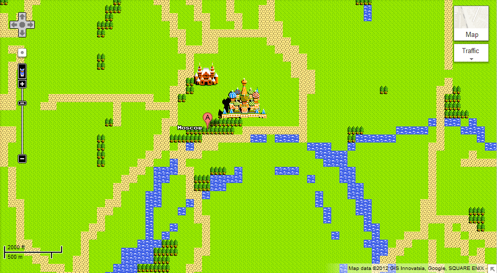

<!--  -->
<!-- _paginate: false -->
<!-- _class: lead -->
<!-- _header: '' -->

# **Mapping trajectories and flows** :rocket: 

### Facilitating a human-centered approach to data-driven movement analytics

Evgeny Noi, noi@ucsb.edu
*UC Santa Barbara, Department of Geography*


---
# Problem 
* Many data companies started publishing various indicators of mobility to help study the effects of COVID on day-to-day life
* Mobility data can help us understand the effects of **non-pharmaceutical interventions** (including the effectiveness of stay-at-home orders)
* Is mobility data ~~good~~ uniform across data sources?
* Can we utilize the concepts/tools learned in class to compare different data sources across space and time?


--- 
<!-- _class: lead -->
<!-- _header: -->
# Data
# :floppy_disk:

---
# Safegraph 
- Census block group level (~ 200k CBGs in the US).
    - average_distance_from_home
    - device_count
    - completely_home_device_count
    - etc. 

---
# Percent of people sheltered in place on March 1, 2020 and 
  


---
# Cuebiq
- County level (~ 3k counties in the US).
    - sheltered_in_place
    - cmi (Cuebiq mobility index)
    - cci (Cuebiq contact index)
    - etc. 

--- 
  


---


---


---


---
# Data pre-processing
1. Create comparable metrics from Safegraph and Cuebiq (Jan 1, 2020 - Nov 15, 2020)
2. Normalize metrics by baseline (Jan 15, 2020 - Feb 15, 2020) according to the geographical unit of analysis (county)
3. Find differences between the metrics
4. Scale down to make *ASSIST* calculations manageable 
    - day --> week
    - 2020-03-01 : 2020-06-20
    - USA --> California (58 counties, centroids)

---


<!-- ---
 -->

---
<!-- _class: lead -->
# Methods
# :memo:

---
# Smoothing Spline ANOVA 
* Decomposition of multivariation functions similar to classical analysis of variance. Notion of main effect and interaction. If no interaction - we have an additive model. 
* Consider one-way ANOVA: $Y_{ij}=\mu_i + \epsilon_{ij}$, where $\mu_i$ are treatment means on treatment levels $i = 1,...,K$ and $\epsilon$ are independent normal errors. $\mu_i = \mu + \alpha_i$, where $\mu$ is the overall mean and $\alpha_i$ is the treatment effect. 

---
# Smoothing Spline ANOVA
* Recast to regression $Y_j = f(x_i) + \epsilon_j$, use the averaging operator $\mathcal{A}$ and identity operator $I$: 
$$f(x) = \mathcal{A}f + (I-\mathcal{A}f) = f_0 + f_x$$

---
# Analytical Framework
* Decompose a tensor product (RKHS) $\mathcal{H}$ space into subspaces with hierarchical structure
* Incorporate locational information as either ~~*region*~~ or *location (longitude, latitude)*  
* Expected difference between the data sources as a function of both location $x_1$ and time $x_2$: $f(x_1, x_2)$ 
* We model locational data with thin-plate spline $W_2^2(\mathbb{R}^2)$ and weeks via a ~~periodic~~ cubic spline space $W_2^2[0,1]$ 

---
# Formulae
* LOCATION EFFECT: 
$\beta_1 \tilde{\phi_1}(x_1) + \beta_2 \tilde{\phi_2}(x_1) + f_1^s(x_1) + f_{12}^{ls}(x_1, x_2) + f_{12}^{ss}(x_1, x_2)$, where $\beta_1 \tilde{\phi_1}(x_1) + \beta_2 \tilde{\phi_2}(x_1)$ linear main effect of location, $f_1^s(x)1)$ smooth main effect, $f_{12}^{ls}(x_1, x_2)$ linear-smooth interaction of location and week, $f_{12}^{ss}(x_1, x_2)$ smooth-smooth interaction of location and week, 
* WEEK EFFECT: 
$f_2^s(x_2) + f_{12}^{ls}(x_1, x_2) + f_{12}^{ss}(x_1, x_2)$

--- 
# Use ASSIST-package 

```bash
       ww       county_fips               lng.V1               lat.V1            differ      
 Min.   :0.34   Length:986         Min.   :-1.6626787   Min.   :-2.2599596   Min.   :-52.08  
 1st Qu.:0.50   Class :character   1st Qu.:-0.6886820   1st Qu.:-0.5823764   1st Qu.:  2.13  
 Median :0.66   Mode  :character   Median :-0.0998438   Median : 0.0964426   Median : 14.75  
 Mean   :0.66                      Mean   : 0.0000000   Mean   : 0.0000000   Mean   : 17.83  
 3rd Qu.:0.82                      3rd Qu.: 0.4759073   3rd Qu.: 0.6686480   3rd Qu.: 30.99  
 Max.   :0.98                      Max.   : 2.8129625   Max.   : 1.8309132   Max.   : 82.60  
```

```r
covid.ssanova <- ssr(differ~lat+lng, data=ndf,
                  rk=list(tp(list(lat,lng)),
                          cubic(ww),
                          rk.prod(tp.linear(list(lat,lng)),cubic(ww)),
                          rk.prod(tp(list(lat,lng)), cubic(ww))))
``` 


---
<!-- _class: lead -->
# Results
# :bar_chart:

---
```bash
Smoothing spline regression fit by GCV method
Call: ssr(formula = differ ~ lat + lng, rk = list(tp(list(lat, lng)), 
    cubic(ww), rk.prod(tp.linear(list(lat, lng)), cubic(ww)), 
    rk.prod(tp(list(lat, lng)), cubic(ww))), data = ndf)

Coefficients (d):
(Intercept)         lat         lng 
  14.141131  -10.128289   -6.578025 

GCV estimate(s) of smoothing parameter(s) : 3.475394e-08 1.287281e-09 2.536786e-09 3.752565e-11 
Equivalent Degrees of Freedom (DF):  419.4962 
Estimate of sigma:  3.887907 

Number of Observations:  986 
```


---


---

# Locational Effect
* The difference between two sources is largest in weeks 10-14. 
* This behavior coincides with the **stay-at-home order** implemented on March 19, 2020 (week 12), which is where we get the maximal spread for the 95% confidence intervals. 
* We can schematically differentiate between two patterns: 
    * immediate-response (weeks 10-14)  
    * normalization (15-25).  

---
<!--  -->


---

# Temporal Effect
* The maps show the effect of week (when compared to the overall average of all other weeks). Strong effect is evident in weeks 10-16, with a somewhat less attenuated influence for weeks 18-22. 

---
<!-- _class: lead -->
<!-- _header: '' -->
<!-- _paginate: false -->
<style scoped>
section {
  /* font-family: 'Times New Roman', serif !important; */
  font-size: 150%;
}
blockquote {
    text-align:left;
    border-left:3px;
    border-right:px;
    width:auto;
    display:inline-block;
    padding:1px px;
    font-size: 80%;
}
</style>



# ~~Beers~~ Questions?
# :beers: 

*Evgeny Noi*  
 
> If geography is a prose, maps are iconography. (Lennar Meri)

:incoming_envelope: noi@ucsb.edu
